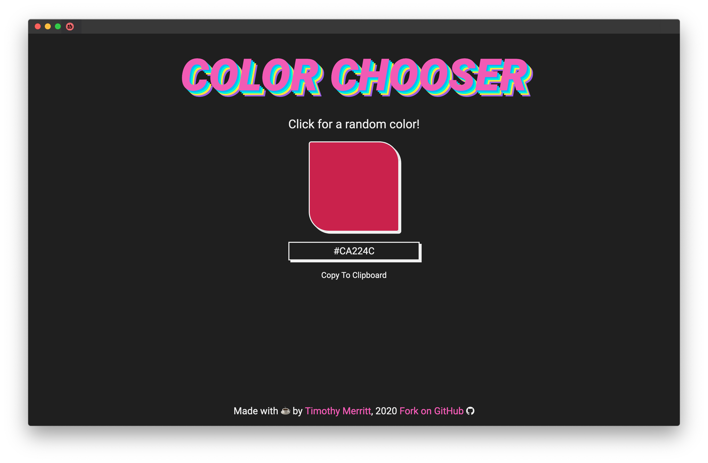

# Color Chooser

This is a React app that uses Hooks to randomly generate a color swatch when the user clicks the swatch, and allows for the current color to be saved to the user's clipboard. Future releases will include multiple swatches and the ability to export custom palettes.

The goal of this project was to practice React Hooks and responsive layout, and well as implement some of JavaScript's Math() functionality.

## Usage

You can use Color Chooser live [here](https://timmybytes.github.io/color-chooser). If you're running the repo locally, from inside the `color-chooser/` directory, run `npm install` for needed dependancies, then `npm start` to enter developement. Color Chooser is bootstrapped from `create-react-app`, so all appropriate CRA scripts should work.

## Contributing

Contributions are welcome, though please first [open a new issue](https://github.com/timmybytes/color-chooser/issues) to discuss proposed changes before submitting a PR.

## License

Color Chooser is released under the [MIT License](./LICENSE).
